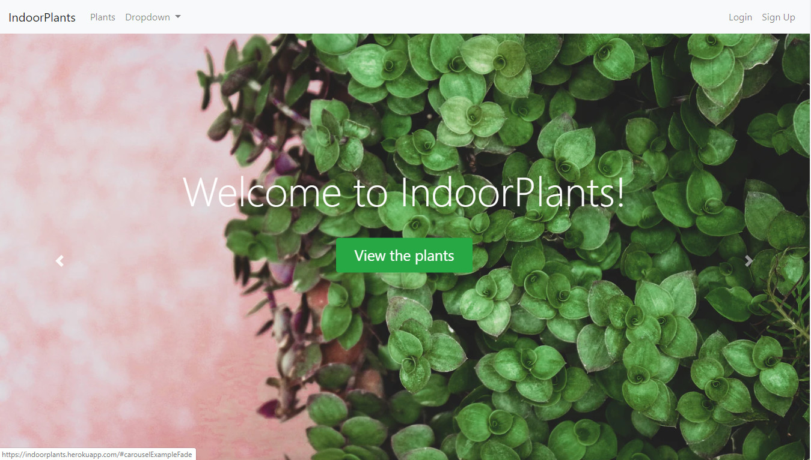
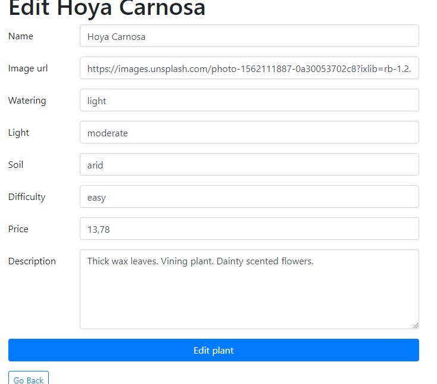
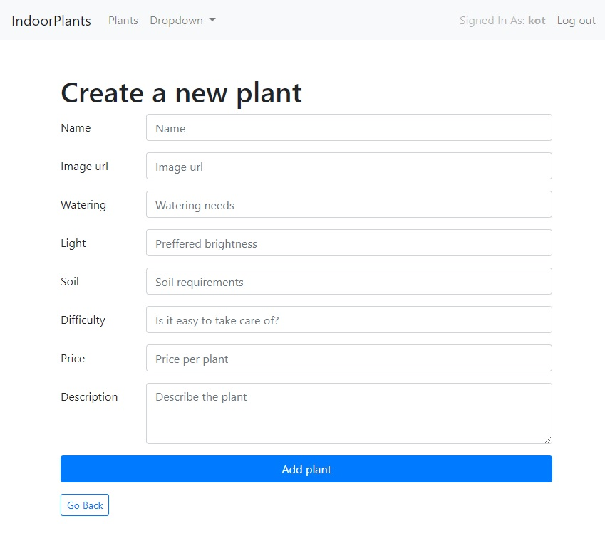
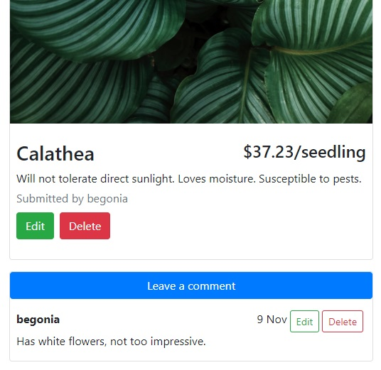
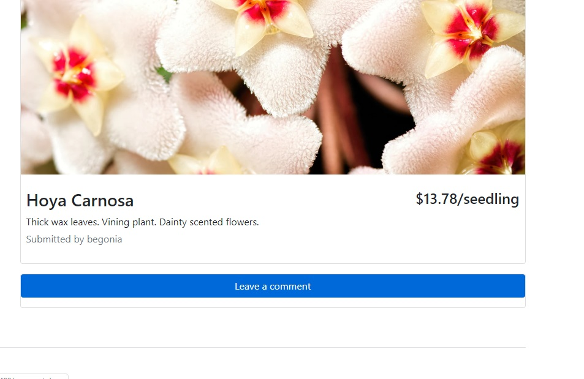

<!-- iframe: 'https://www.youtube.com/embed/Bqrl4QYQEr0' -->

__Table of content:__
<!-- TOC -->

- [What is it?](#what-is-it)
- [Core technologies](#core-technologies)
- [Main features](#main-features)
    - [API Endpoints](#api-endpoints)
- [How To Use?](#how-to-use)
    - [Authentication, Authorization and general use](#authentication-authorization-and-general-use)
    - [Creating a plant](#creating-a-plant)
    - [View plant details](#view-plant-details)
    - [Editing a plant](#editing-a-plant)
    - [Removing a plant](#removing-a-plant)
    - [Leaving a comment](#leaving-a-comment)
    - [Editing comment](#editing-comment)
    - [Deleting comment](#deleting-comment)
- [Backend](#backend)

<!-- /TOC -->

## What is it?

IndoorPlants is a web app for plants enthusiasts, to keep track and discuss their favourite species. It has typical CRUD functionality and follows REST-ful convention.

## Core technologies

    
    
    
    
    
    
    

## Main features

* Responsive design with __Bootstrap 4__
* __Authentication__: only logged in users can create a new plant and leave a comment
* __Authorization__: only the user that created a comment can edit & delete it; only the user that created a given plant can edit or delete it
* Editable __comments__ (CRUD: create, edit and delete a comment)
* __CRUD__: create, list(read), update and delete a plant post
* Follows REST-ful convention

### API Endpoints
Endpoints | Functionality
------------ | -------------
POST /register | Register a new user
POST /login | Sign in a user
GET /plants | Fetch all plants
GET /plants/new | Create a new plant
GET /plants/`<Id>`/edit| Fetch individual plant
PUT /plants/`<Id>` | Modify a plant
DELETE /plants/`<Id>` | Delete a plant
GET /plants/`<Id>`/comments/`<CommentID>`/edit | Modify a comment on a plant
GET /plants/`<Id>`/comments/`<CommentID>`/new | Create a new comment on a plant
DELETE /plants/`<Id>`/comments/`<CommentID>` | Remove a comment

## How To Use?

### Authentication, Authorization and general use
- Click on *Login* button to authenticate
- You'll be directed to the login page, enter login and password data
- Your dashboard screen should open with your name on the top-right
- App Navigation :
    1. __Sign-up__: Click on *Sign up* button (on the top of every page) to create a new user. You'll be redirected to the register page.
    2. __Logout__: The *Logout* button on the top right of the header will log you out from the current session. All your plants will be saved for further use.

### Creating a plant

- Click on *Add a new plant* button on the plants page for adding a new plant.
- Add all the details of your plant
    1. __Name__: Add title/description of your plant (compulsory)
    2. __Image url__: Add plant picture (compulsory)
    3. __Watering__: Add the watering needs of the plant
    4. __Light__: Add your plants lighting requirements.
    5. __Soil__: Add preferred soil for your plant.
    6. __Difficulty__: Is your plant difficult to take care of? 
    7. __Price__: Typical price for this plant.
    8. __Description__: Add some additional information about your plant.
- Click on *Edit plant* to save the plant

### View plant details
- Click on *More* button below your plant on the main (dashboard) page.
 

### Editing a plant
- If you are logged in, and you are authorized to edit the plant, you will be able to edit it.
- Follow the same rules as that of adding a plant.
- Click on *Edit plant* button to save and update the plant.

### Removing a plant
- If you are logged in, and you are authorized to edit the plant, you will be able to edit it.
- The *Remove* button beneath the plant.
- You will be redirected to the plant dashboard upon removal.

### Leaving a comment
- Click on *More* button below your plant.
- You're on the specific plant page now.
- You can leave a comment if you're logged in.
 

### Editing comment
- Click on *More* button below your plant.
- You're on the specific plant page now.
- You see plant detail, *Leave comment* button and all the comments associated with it.
- If you're the author of a comment, and logged in, *Edit* button will be visible next to the comment.
- Clicking the *Edit* button will redirect you to a page where you can edit your entry.
- After saving change to your comment you'll be redirected back to the specific plant's page. Where your newly edited comment is visible.

### Deleting comment
- Click on *More* button below your plant.
- You're on the specific plant page now.
- You see plant detail, *Leave comment* button and all the comments associated with it.
- If you're the author of a comment, and logged in, *Delete* button will be visible next to the comment.
- Clicking the *Delete* button will remove your comment.

<!-- https://youtu.be/Bqrl4QYQEr0 -->

## Backend

To achieve the end result the following tools were utilized:

- `PassportJS` for authentication
- `MongoDB` for storing data
- `Node.js` and `ejs` view engine for SSR
- `Express.js` for routing and flash messages and sessions
- own middleware for authorization
- `Git` & `GitHub` for version control
- `Heroku` for deployment

And that's it in the nutshell!
