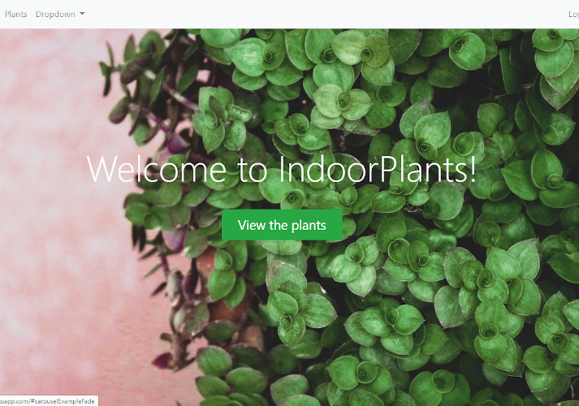

**Throughout this project I've used multiple tools and technologies including:**

* HTML5
* CSS3
* JavaScript
* Bootstrap 4
* DOM Manipulation
* jQuery
* Unix(Command Line) Commands
* NodeJS
* NPM
* ExpressJS
* REST
* MongoDB
* Authentication
* Authorization

