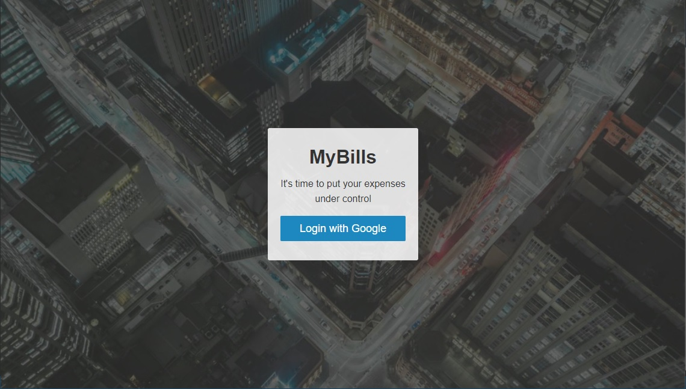

This web app is an expense manager called MyBills. The features include: authentication, user accounts, routing, testing, form validation, database storage.

## The following technologies have been used to achieve the end goal:

- React
- Redux
- React-Router
- Webpack
- Babel
- Testing with Jest
- Enzyme
- Firebase
- Authentication
- Git/GitHub
- ES6/ES7

