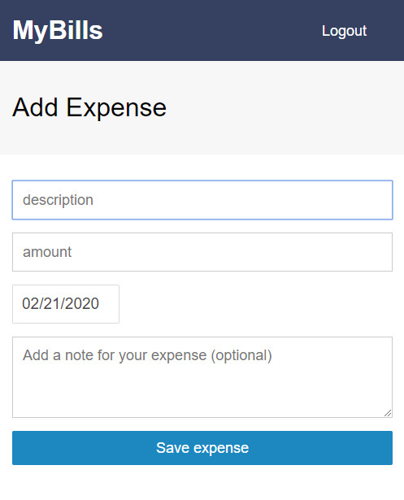
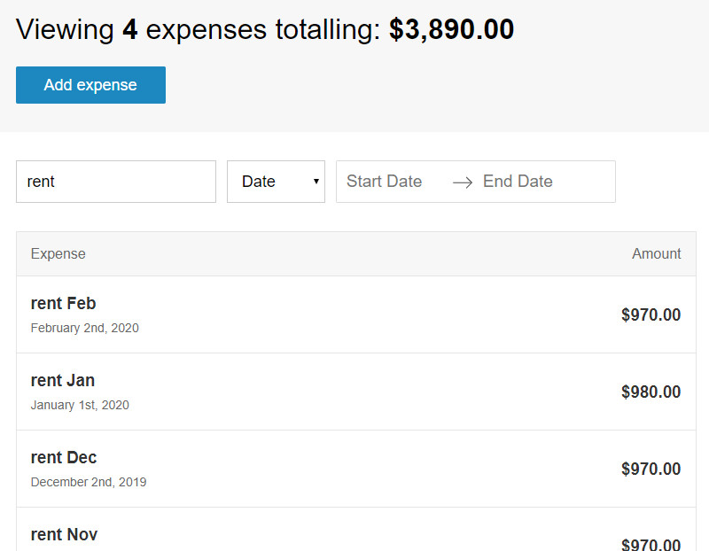

<!-- # iframe: 'https://www.youtube.com/embed/dQw4w9WgXcQ' -->
__Table of content:__
<!-- TOC -->

- [Test login:](#test-login)
- [What is it?](#what-is-it)
- [Core functionality:](#core-functionality)
- [How It Works?](#how-it-works)
        - [API Endpoints](#api-endpoints)
- [How To Use?](#how-to-use)
    - [Authentication and general use](#authentication-and-general-use)
    - [Creating an expense](#creating-an-expense)
    - [Filtering/Sorting expenses](#filteringsorting-expenses)
    - [Editing an expense](#editing-an-expense)
    - [Removing an expense](#removing-an-expense)
- [The following technologies have been used to achieve the end goal:](#the-following-technologies-have-been-used-to-achieve-the-end-goal)
    - [To quote Oscar Wilde:](#to-quote-oscar-wilde)

<!-- /TOC -->

    
    
    
    
    
    
    
    
    
    
    
    

## Test login:

>__login__ : `mybills.app.test@gmail.com`  
>__password__ : `123.app.test`

## What is it?

MyBills App is a web app: a secure expense manager with authentication and user accounts. The features include: private routing, form validation and database storage. To streamline the development and limit any potential bugs  the codebase includes tests with Jest and Ezyme.

## Core functionality:
- login with __Google__
- store expenses in database
- add new expenses
- edit existing expenses
- remove expenses
- sort expenses by amount/date
- filter expenses with text and date filters
- display summary for all visible expenses
- fully responsive design

## How It Works?

User data is stored in the Firebase cloud. The accounts are authenticated via Google. Front-end is build with React, bundled with Webpack and styled with Sass. 

#### API Endpoints
Endpoints | Functionality
------------ | -------------
POST /auth/signup | Register a new user
POST /auth/login | Sign in a user
GET / | Fetch all user expenses
GET /expense/`<expenseId>`| Fetch individual expense
PUT /expense/`<expenseId>` | Modify an expense entry
DELETE /expense/`<expenseId>` | Delete an expense entry

## How To Use?

### Authentication and general use
- Click on *Login with Google* button to authenticate using a Google Account
- From the pop-up select the google account you want to use
- Your dashboard screen should open with your name on the top-right
- App Navigation :
    1. __Dashboard__: Clicking the *Expensify* text on the header from any page will redirect you to the expenses dashboard.
    2. __Logout__: The *Logout* button on the top right of the header will log you out from the current session. All your expenses will be saved for further use.

### Creating an expense

- Click on *Add Expense* button below your expense summary for adding an expense.
- Add all the details of your expense
    1. __Description__: Add title/description of your expense (compulsory)
    2. __Amount__: Add the amount you spent format : *[...xx.yy]* (compulsory)
    3. __Date__: Add the date of the expenditure *(defaults to current date)* 
    4. __Note__: Add some additional information about your expense.
- Click on *Add Expense* to save the expense
- View it on your dashboard

### Filtering/Sorting expenses

- Visit your dashboard page and the expense summary will show you the total number of expenses on screen and the amount they total.
- Use the filters to filter your expenses
    1. __Search By Title__: Search for your expense by it's title and recieve per-keystroke feedback of the value typed.
    2. __Search By Date__: Search for a group of expenditures between two particular dates i.e the start date and the end date.
- Sort your expenses using the sort dropdown/select box
    1. __Amount__: Displays all the expenses on screen in the order of costliest expense first and the cheapest last.
    2. __Date__: Displays all the expenses on screen in the order such that the expense with the latest date of expenditure comes first.
- The *Unfiltered Expenses* component will continue to show how many expenses have been hidden due to the filters applied. 

### Editing an expense

- Clicking on any displayed expense will allow you to edit it.
- Follow the same rules as that of adding expense
- Click on *Add Expense* button to save and update the expense

### Removing an expense
- Clicking on any displayed expense will allow you to remove it
- The *Remove* button beneath the *Add Expense* button will delete your expense
- Clicking on that button will ask for your confirmation for removal
- Click on *Remove* on the pop-up to confirm the removal
- You will be redirected to the dashboard upon removal.

## The following technologies have been used to achieve the end goal:

- `React` for UI
- `Redux` for managing state
- `React-Router` for client-side routing with public/private pages
- `Webpack` for bundling
- `Babel` for __ES6 / ES7__ syntax
- `Enzyme` with `Jest` for Unit Testing
- `Moment.js` for parsing, validating, manipulating, and displaying dates and times
- `Node.js` and `Express.js` on back-end
- `Redux-thunk` as middleware
- `Firebase` for storing data and Google based authentication
- `SASS` for styling
- `Git` & `GitHub` for version control
- `Heroku` for deployment

### To quote Oscar Wilde:

> Anyone who lives within their means
> suffers from a lack of imagination.

However, I myself do not wish to overspend. Hence this app. Enjoy! If you want to explore, <a href='#Test-login'>there's test login</a>. 

