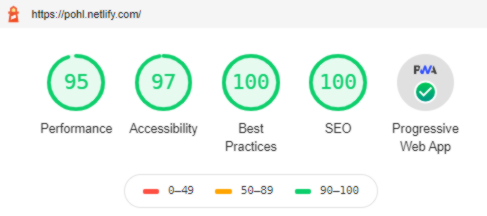

__Table of content:__
<!-- TOC -->

- [What it it?](#what-it-it)
- [Core technologies](#core-technologies)
- [Highly optimized](#highly-optimized)
- [PWA](#pwa)
- [Syntax highlighting](#syntax-highlighting)
- [Dark mode](#dark-mode)
- [GraphQL & Markdown](#graphql--markdown)
- [Parallax Tilt Effect](#parallax-tilt-effect)
- [Contact form](#contact-form)
- [Speedy, optimized, responsive images](#speedy-optimized-responsive-images)
- [Responsive (design & titled card)](#responsive-design--titled-card)

<!-- /TOC -->

## What it it?

This is a feature-rich portfolio project; with many things like SEO, speedy, optimized images or responsive design for all devices (mobile, tablet and desktop) already implemented and some more to come. Let's take a look at all the available features:

## Core technologies
<p>
    
    
    
    
    
    
    
    
</p>

## Highly optimized

Despite being heavily SEO optimized, performance and accessibility have also been a major factor when implementing this portfolio. This leads to a great Lighthouse result.

 

## PWA

Implements Progressive Web Apps features (i.e. offline capability). With the help of manifest and web workers we get a product that functions offline and where wifi is unreliable. 

Among service worker features, is a message that displays when a service worker updates.
The following code displays a confirm prompt asking the user whether they would like to refresh the page when an update is found:

```JS
export const onServiceWorkerUpdateReady = () => {
	const answer = window.confirm(`This application has been updated. ` + `Reload to display the latest version?`);
	if (answer === true) {
		window.location.reload();
	}
};

export const registerServiceWorker = () => true;
``` 

## Syntax highlighting
Code properly formatted is automatically highlighted with `Prism`. The code lines are numbered and languages labeled for clarity.

Which gives us the following effect: 

~~~javascript
class Person {
    constructor() {
        this.name = "Katarzyna Pohl";
        this.traits = ["DESIGN", "CODE", "CREATE"];
    }
    fun() {
        do{
            enjoy();
        } while( coding || drawing == play);
    }
}
~~~ 

## Dark mode

Strained eyes? DarkMode to the rescue! By implementing a custom `use-dark-mode` React Hook and `.dark-mode` and `.light-mode` css classes, I've arrived at the two different switchable styles. After adding a toggle switch on the right side of the header, we get a fully functioning customizable dark/light mode, and the state of the app is stored in the `localStorage`. 

## GraphQL & Markdown
To glue it all the site relies on GraphQL. It queries the content, and generates static pages  from markdown files (the .md files are located in the `src/projects` directory). It is done with GraphQL:

~~~JS
results.data.allMarkdownRemark.edges.forEach(({ node }) => {
		const { slug, layout } = node.fields;

		createPage({
			path: slug,

			component: path.resolve(`./src/templates/${layout || 'page'}.tsx`),
			context: {
				slug
			}
		});
	});
~~~
 Static pages are linked automatically, and they have ability to embed responsive video as well as codepen components if needed. 

## Parallax Tilt Effect
Hopefully, you enjoyed playing with the tilt card on home page, I know I did. It's intended to be fun and playful. And honestly I had great time implementing it as well.


Curious as to how it works behind the scenes? 

In order to achieve the 3d parallax effect, there are two things that work in tandem: `react-parallax-tilt`  npm module and css styling. `react-parallax-tilt` does all the heavy lifting and computations, while css is the icing on top that deepens the 3D effect.

This bit of css elevates inner HTML from the surface of the card: 

```css
transform: translateZ(60px);
transform-style: preserve-3d;
```
And below the card there's an additional shadow: 
```css
box-shadow: -2px -2px 2px rgba(224, 223, 223, 0.1), 3px 3px 10px 1px rgba(36, 36, 36, 0.2);
``` 

## Contact form

Super light weight form uses a tiny `react-hook-form` library definitely improved my process of arriving at a super light weight great preforming contact form. In comparison, Redux-form and Formik give a less pleasant developer experience and trigger more re-rendering. On the back-end there's a spam filter to weed out suspicious entries.

Main form logic is therefore quite simple and developer friendly:
~~~JS
const ContactForm = () => {
	const { register, handleSubmit, errors, setValue, setError } = useForm();
	const [ feedbackMsg, setFeedbackMsg ] = useState(null);
	const onSubmit = (data, e) => {
		e.preventDefault();
		fetch('/?no-cache=1', {
			method: 'POST',
			headers: { 'Content-Type': 'application/x-www-form-urlencoded' },
			body: encode({
				'form-name': 'contact',
				...data
			})
		})
			.then((response) => {
				console.log(response);
				if (response.status === 200 && !response.redirected) {
					setFeedbackMsg(`Thanks for reaching out! I'll get back to you soon.`);
				} else {
					setFeedbackMsg(`Something went wrong, please try again later.`);
				}
				e.target.reset();
			})
			.catch((error) => {
				setFeedbackMsg('Oops, the form could not be submitted. Are you offline? Please try again later.');
				console.log(error);
			});
  };
  
  ...
~~~ 

## Speedy, optimized, responsive images

I've been playing with `gatsby-image`. It is a React component specially designed to work seamlessly with Gatsby’s GraphQL queries. It combines Gatsby’s native image processing capabilities (pretty slick) with advanced image loading techniques to easily and completely optimize image loading. 

Typically large, unoptimized images dramatically slow down a site. With `gatsby-image` I wrote a GraphQL query which creates multiple thumbnails with optimized JPEG and PNG compression. 

```JSX
const Image = () => (
  <StaticQuery
    query={graphql`
      query {
        placeholderImage: file(
          relativePath: { eq: "cv.jpg" }
        ) {
          childImageSharp {
            fluid(maxWidth: 1600) {
              ...GatsbyImageSharpFluid
            }
          }
        }
      }
    `}
    render={data => }
  />
);
```

The gatsby-image component automatically sets up the “blur-up” effect as well as lazy loading of images further down the screen. And then it displays to the user different images at different breakpoints, it's pretty sweet.

If you'd like to learn more or have any questions please feel free to contact me.
Oh, and feel free to give it star on GitHub if you like.

## Responsive (design & titled card)

This portfolio is optimized for phones, tablets and desktops. The styling is done with CSS3 post-processor Sass.
The images scale nicely, and for smaller resolutions use smaller source files. The interactive tilted card scales as well, an on mobile uses gyroscope (where the browser provide the functionality, it's still an experimental feature) to orient itself.