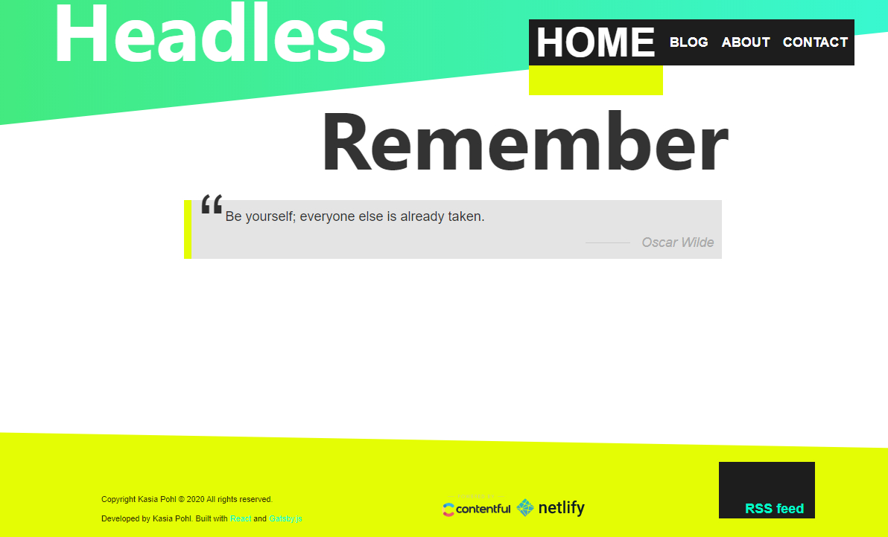

<!-- 

Click to expand

- [What is it?](#What-is-it)
- [Core technologies](#Core-technologies)
- [PWA](#PWA)

 -->
__Table of content:__
<!-- TOC -->

- [What is it?](#what-is-it)
- [Core technologies](#core-technologies)
- [PWA](#pwa)
- [Headless](#headless)
- [Contact form](#contact-form)
- [RSS feed](#rss-feed)
- [Responsive asymetric layout (header, footer)](#responsive-asymetric-layout-header-footer)
- [Typography driven design](#typography-driven-design)

<!-- /TOC -->

<!-- https://youtu.be/dQw4w9WgXcQ -->

## What is it?

It's a Headless React blog created with Gatsby and GraphQL. The content is created with Contentful CMS. 

## Core technologies

    
    
    
    
    
    
    
    
    

## PWA

Progressive web app with offline capabilities.

## Headless

Content comes from Contenful CMS. GrapQL to the rescue.

## Contact form

Includes spam bot filters and Google Captcha.

## RSS feed

## Responsive asymetric layout (header, footer)

## Typography driven design